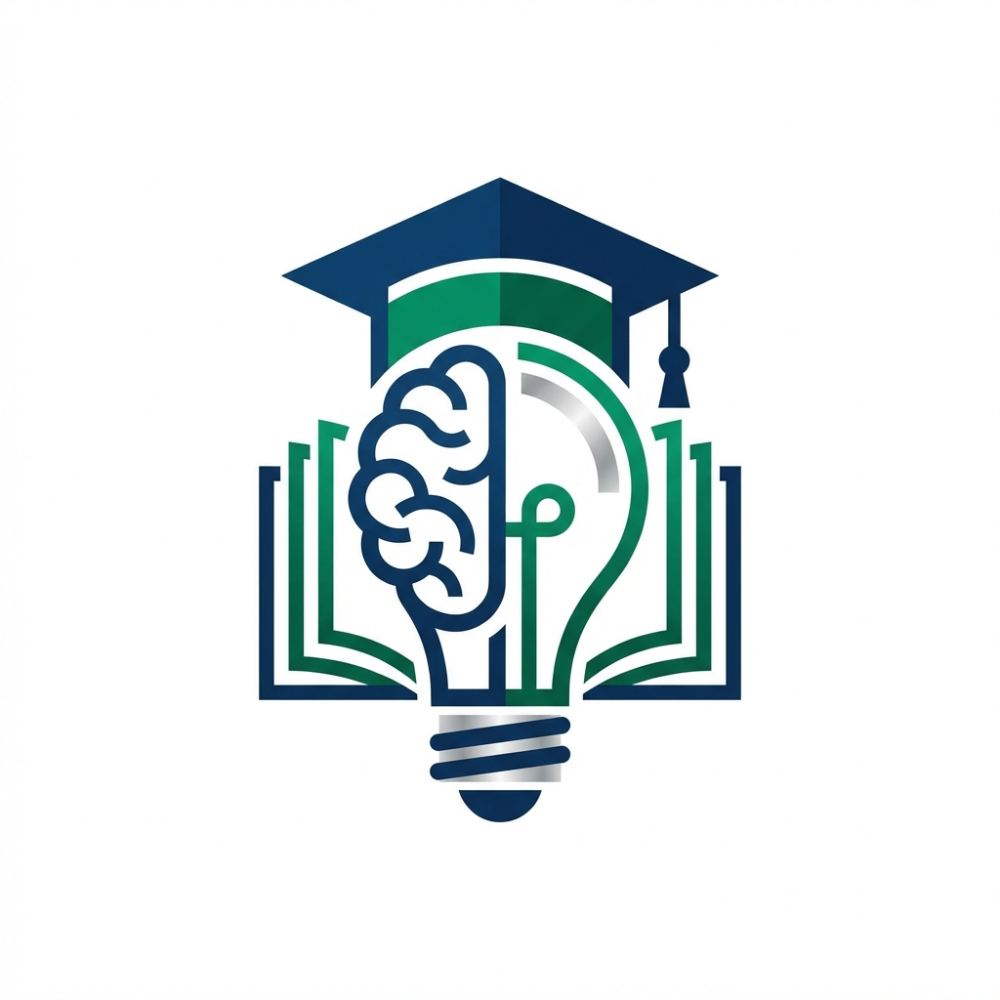
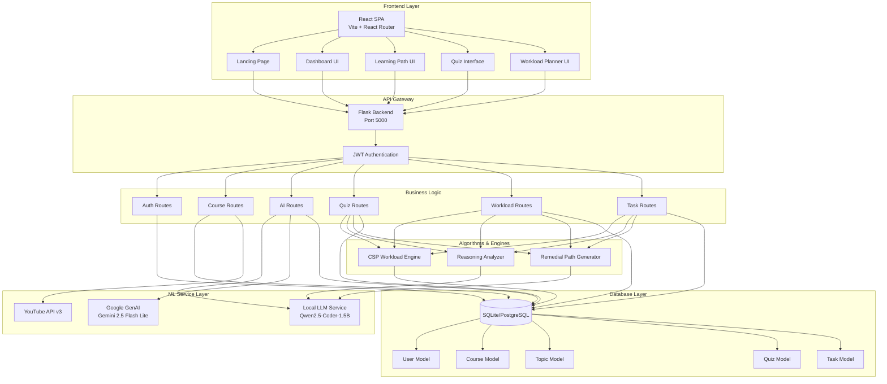

# AI Academic Companion - Intelligent Learning Management System



## 📋 Executive Summary

The **AI Academic Companion** is an advanced, AI-powered Learning Management System (LMS) designed to revolutionize personalized education. This comprehensive platform leverages cutting-edge machine learning models, intelligent workload optimization algorithms, and adaptive learning pathways to create a truly personalized educational experience for students.

Unlike traditional LMS platforms that offer static content delivery, our system dynamically adapts to each student's learning pace, style, and performance. It uses sophisticated AI algorithms to generate personalized study materials, adaptive quizzes, remedial content, and intelligent workload scheduling—all while tracking student progress and providing real-time analytics.

**Key Value Proposition:**
- **Personalized Learning Paths**: Dynamically adjusted based on student performance and preferences
- **AI-Powered Content Generation**: Automated notes, quizzes, and remedial materials tailored to individual needs
- **Intelligent Workload Optimization**: CSP-based scheduling that respects student constraints (sleep, school hours)
- **Real-Time Performance Analytics**: Comprehensive dashboards tracking progress, stress levels, and learning patterns
- **Adaptive Testing & Remediation**: Automatic difficulty adjustment and targeted remedial content generation

---

## 🎯 Key Features

### 1. **Intelligent Authentication & User Management**
- **Secure Registration & Login**: JWT-based authentication with bcrypt password hashing
- **Unique Student ID Generation**: Automatic generation of unique student IDs in format `STU{YEAR}{6-digit-number}`
- **Profile Management**: Students can update learning styles (visual, auditory, kinesthetic) and performance levels
- **Role-Based Access Control**: Admin and student roles with different permissions

**Technical Implementation:**
- Uses Flask-JWT-Extended for token-based authentication
- Password hashing with bcrypt for security
- SQLAlchemy ORM for database interactions
- Email uniqueness validation to prevent duplicate accounts

---

### 2. **AI-Powered Course Search & Recommendation**
- **Smart Course Discovery**: AI analyzes course descriptions and recommends based on student profile
- **Related Searches**: Suggests related topics and courses using similarity algorithms
- **Chatbot Integration**: Natural language course search with context-aware responses
- **Category Filtering**: Courses organized by category and difficulty level

**Technical Implementation:**
- Google Generative AI (Gemini 2.5 Flash Lite) for course recommendations
- Semantic search using sentence embeddings
- Context-aware chatbot using conversation history from database
- Real-time course catalog with ratings and student counts

---

### 3. **Dynamic Learning Path Generation**
- **Personalized Pathways**: Topics arranged in optimal sequence with prerequisite management
- **AI Custom Paths**: Students can request custom learning paths on any topic
- **Deadline Calculation**: CSP-based intelligent deadline assignment considering student schedule
- **Progress Tracking**: Real-time completion percentage and milestone tracking
- **Video Integration**: YouTube video recommendations for each topic

**Technical Implementation:**
- Graph-based prerequisite tracking (Topics → Prerequisites relationship)
- Workload balancer calculates optimal deadlines using Constraint Satisfaction Problem (CSP)
- YouTube Data API v3 integration for video recommendations
- Sequential topic ordering with dynamic adjustment

**Innovation:**
- **Automatic Remedial Path Insertion**: When students fail a quiz, the system automatically generates simplified remedial content and inserts it into the learning path at the optimal position

---

### 4. **AI-Generated Study Notes**
- **Comprehensive Note Generation**: AI creates detailed, structured notes for each topic
- **Multi-Section Format**: Covers core concepts, applications, examples, and common misconceptions
- **Markdown Support**: Notes stored in markdown format for rich formatting
- **PDF Export**: One-click PDF generation from markdown notes
- **Editable Content**: Students can edit and customize AI-generated notes

**Technical Implementation:**
- Local LLM (Qwen2.5-Coder-1.5B-Instruct) for note generation
- Structured prompting for consistent note format
- Markdown-to-HTML-to-PDF conversion pipeline
- Database storage with versioning support

---

### 5. **Adaptive Quiz Generation & Evaluation**
- **Dynamic Quiz Creation**: AI generates relevant multiple-choice questions for each topic
- **Reasoning-Based Questions**: Questions require conceptual understanding, not just recall
- **Automatic Grading**: Instant feedback with detailed explanations
- **Failure Remediation**: Auto-generates remedial content when quiz score < 70%
- **Performance Analytics**: Tracks misconceptions and reasoning patterns

**Technical Implementation:**
- LLM-based question generation with structured JSON output
- Reasoning analysis using AI to identify student misconceptions
- Automatic remedial topic creation and insertion into learning path
- Quiz attempt history with detailed analytics

**Innovation:**
- **Misconception Detection**: AI analyzes wrong answers to identify specific gaps in understanding
- **Dynamic Path Adjustment**: Learning path automatically adapts based on quiz performance

---

### 6. **Intelligent Workload Management**
- **Constraint Satisfaction Problem (CSP) Engine**: Optimizes task allocation across available hours
- **User Schedule Awareness**: Respects sleep hours, school hours, and personal constraints
- **Stress Level Detection**: Calculates cognitive load and warns about overload
- **Priority-Based Allocation**: High-priority tasks scheduled first
- **Weekend Optimization**: Leverages extra weekend hours for flexible tasks

**Technical Implementation:**
- Greedy allocation algorithm with backtracking for conflict resolution
- Regression-based estimation for topic complexity
- 7-day rolling window with daily capacity bins
- Task categorization (manual vs. course-based)

**Algorithms Used:**
- **Greedy Bin Packing**: Allocates tasks to earliest available day within capacity
- **Heuristic Estimation**: Calculates task duration based on difficulty multiplier and description length
- **Stress Analytics**: Load ratio calculation (allocated/capacity) with threshold-based stress levels

---

### 7. **AI Creative Challenges**
- **Brain-Testing Tasks**: AI generates creative, out-of-box challenges
- **Context-Aware**: Challenges relate to active courses or general problem-solving
- **Skill Development**: Focuses on synthesis, application, and lateral thinking
- **Automatic Scheduling**: Challenges auto-added with 2-day deadlines

**Technical Implementation:**
- LLM prompting with creative task requirements
- Dynamic task insertion into workload planner
- Tagged as "AI Challenge" for easy identification

---

### 8. **Real-Time Analytics Dashboard**
- **Course Progress Tracking**: Visual progress bars for each enrolled course
- **Upcoming Deadlines**: Smart sorting by urgency
- **Chat History**: Complete conversation context preserved
- **Performance Metrics**: Completion rates, quiz scores, time spent

**Technical Implementation:**
- PostgreSQL/SQLite database with complex joins
- Real-time data aggregation and calculation
- React-based interactive charts with Framer Motion animations

---

### 9. **Context-Aware AI Chatbot**
- **Multi-Context Support**: General, course-specific, topic-specific, and quiz-specific conversations
- **Conversation Memory**: All chat history persisted to database
- **Intent Classification**: Zero-shot classification to understand user queries
- **Smart Responses**: Contextual answers considering user's current learning state

**Technical Implementation:**
- Local LLM for response generation
- Database-backed conversation history
- Context switching based on user's current page
- Intent detection using LLM-based zero-shot classification

---

### 10. **Admin Dashboard**
- **User Management**: View all registered users, promote to admin
- **Course Management**: Create, edit, and delete courses
- **Analytics Overview**: System-wide statistics and trends
- **Content Moderation**: Review and manage AI-generated content

---

## 🌐 Web Pages & User Interface

### **1. Landing Page** (`Landing.jsx`)
**Purpose**: First impression and marketing page

**Features:**
- Professional hero section with call-to-action
- Feature highlights with animations
- Responsive design optimized for all devices
- Smooth scroll animations using Framer Motion

**Design:**
- Modern gradient backgrounds with glassmorphism effects
- Typography using custom Google Fonts (Inter)
- Interactive hover effects on buttons and cards
- Mobile-first responsive layout

---

### **2. Login Page** (`Login.jsx`)
**Purpose**: Secure user authentication

**Features:**
- Email and password login
- Registration form with validation
- Date of birth picker
- Error handling with user-friendly messages
- JWT token management

**Security:**
- Client-side validation before submission
- Secure token storage in localStorage
- HTTPS-ready for production deployment

---

### **3. Dashboard** (`Dashboard.jsx`)
**Purpose**: Central hub for student activity

**Features:**
- **Enrolled Courses Grid**: Visual cards with progress bars
- **Upcoming Deadlines**: Sorted by urgency with color coding
- **Quick Stats**: Total courses, completion percentage, quiz scores
- **Recent Activity**: Timeline of latest actions

**Interactivity:**
- Click course cards to navigate to learning path
- Hover effects with smooth transitions
- Real-time data updates

---

### **4. Courses Page** (`Courses.jsx`)
**Purpose**: Browse and enroll in courses

**Features:**
- **AI-Powered Search**: Natural language course discovery
- **Smart Filters**: Category, difficulty level, rating
- **AI Recommendations**: "Recommended for You" section
- **Related Searches**: Contextual suggestions
- **Chatbot Integration**: Ask questions about courses in real-time

**UI Elements:**
- Course cards with ratings and student counts
- Search bar with debounced input
- Filter dropdowns with multi-select
- Enroll/View Path buttons with state management

---

### **5. Learning Path** (`LearningPath.jsx`)
**Purpose**: Topic-by-topic learning interface

**Features:**
- **Sequential Topic Display**: Ordered by prerequisites
- **Video Player**: Embedded YouTube videos
- **Progress Tracking**: Mark topics as complete
- **AI Notes Generation**: One-click note creation
- **Quiz Launch**: Take quizzes directly from topic view
- **Suggested Deadlines**: CSP-calculated optimal due dates

**UI/UX:**
- Expandable topic cards with smooth animations
- Checkmarks for completed topics
- Progress bar showing course completion
- Sticky navigation for easy access

**Innovation:**
- **Persistent Course Selection**: Selected course remembered across sessions

---

### **6. Quiz Page** (`Quiz.jsx`)
**Purpose**: Interactive assessment and evaluation

**Features:**
- **Multiple Choice Questions**: Radio button selection
- **Timer Display**: Optional time limits
- **Instant Feedback**: Correct/incorrect indicators
- **Explanations**: Detailed reasoning for each answer
- **Score Calculation**: Real-time scoring with pass/fail determination
- **Remedial Content**: Automatic generation on failure

**Interactivity:**
- Question navigation (next/previous)
- Answer selection with visual feedback
- Submit confirmation modal
- Results page with detailed breakdown

---

### **7. Analytics Page** (`Analytics.jsx`)
**Purpose**: Visualize learning patterns and performance

**Features:**
- **Performance Charts**: Line graphs showing progress over time
- **Course Completion Heatmap**: Visual representation of activity
- **Quiz Score Trends**: Track improvement across topics
- **Time Spent Analysis**: Where students invest their time
- **Stress Level Indicators**: Workload vs. capacity

**Visualizations:**
- Interactive charts using Chart.js or D3.js
- Color-coded stress levels (low, medium, high, critical)
- Responsive grid layout for multiple metrics

---

### **8. Tasks/Workload Page** (`Tasks.jsx`, `Workload.jsx`)
**Purpose**: Manage and optimize student workload

**Features:**
- **Task List**: All manual and auto-generated tasks
- **Add Custom Tasks**: Students can create personal tasks
- **Workload Optimizer**: Click to run CSP engine
- **7-Day View**: Scrollable calendar with task allocation
- **Stress Indicators**: Visual warnings for overload days
- **Schedule Settings**: Customize sleep and school hours

**UI Components:**
- Kanban-style task cards (Todo, In Progress, Done)
- Drag-and-drop task management
- Daily capacity bars showing allocated vs. available hours
- Color-coded priority tags

---

### **9. Admin Dashboard** (`AdminDashboard.jsx`)
**Purpose**: Administrative control panel

**Features:**
- **User List**: Search and filter all students
- **Course Management**: CRUD operations for courses
- **System Analytics**: Total users, courses, enrollments
- **Promote Admin**: Grant admin privileges to users

---

### **10. AI Chat Component** (`AIChat.jsx`)
**Purpose**: Persistent chatbot interface

**Features:**
- **Context-Aware Conversations**: Adapts to current page
- **Markdown Rendering**: Rich text responses
- **Conversation History**: Scroll through past messages
- **Typing Indicators**: Visual feedback during AI response
- **Collapsible Interface**: Minimize to save screen space

**Design:**
- Floating chat bubble in bottom-right corner
- Smooth slide-in/out animations
- Message bubbles with timestamp
- Auto-scroll to latest message

---

## 🏗️ System Architecture



### **Architecture Layers:**

1. **Frontend Layer**: React-based SPA with component-based architecture
   - Vite for fast development and build
   - React Router for client-side routing
   - Framer Motion for smooth animations
   - TailwindCSS for utility-first styling

2. **API Gateway**: Flask backend serving RESTful APIs
   - CORS enabled for cross-origin requests
   - JWT-based authentication middleware
   - Request validation and error handling

3. **Business Logic**: Modular route blueprints
   - Separated by domain (auth, courses, AI, quizzes, workload)
   - Service-oriented architecture
   - Dependency injection for database access

4. **ML Service Layer**: AI/ML model integration
   - Local LLM for offline generation
   - Google GenAI for advanced reasoning
   - YouTube API for video recommendations

5. **Database Layer**: Relational data persistence
   - SQLAlchemy ORM for database abstraction
   - Migration support with Alembic
   - Relationship mapping (One-to-Many, Many-to-Many)

6. **Algorithms & Engines**: Custom intelligent systems
   - CSP solver for workload optimization
   - Reasoning analysis for misconception detection
   - Dynamic path adjustment algorithms

---

## 🔄 Data Flow

### **1. User Authentication Flow**
```
User → Login Form → Flask Auth Route → Validate Credentials → Generate JWT → Return Token → Store in localStorage → Include in API Headers
```

### **2. Course Enrollment Flow**
```
User → Browse Courses → Click Enroll → POST /api/courses/enroll → Create Enrollment Record → Generate Learning Path → Calculate Deadlines (CSP) → Return Path → Display Topics
```

### **3. Quiz Generation Flow**
```
User → Select Topic → Click "Generate Quiz" → POST /api/ai/quiz/generate → LLM Prompt → Parse JSON Response → Create Quiz + Questions in DB → Return quiz_id → Fetch Questions → Display Quiz
```

### **4. Workload Optimization Flow**
```
User → Navigate to Workload Page → Click "Optimize" → GET /api/workload/optimize → Fetch Tasks + Topics → Fetch UserSchedule → Run CSP Algorithm → Allocate to Days → Calculate Stress Levels → Return 7-Day Plan → Display Calendar
```

### **5. Remedial Content Flow**
```
User → Submit Quiz → Score < 70% → Trigger Remedial Generation → LLM Prompt with Topic → Generate Simplified Content → Create New Topic → Adjust Sequence Orders → Insert into Path → Notify User
```

### **6. AI Chat Flow**
```
User → Type Message → POST /api/chat → Save Message to DB → Load Context (Messages + Current Page) → Send to LLM → Get Response → Save Response to DB → Return to User → Display in Chat
```

---

## 🛠️ Tech Stack

### **Frontend**
| Technology | Version | Purpose |
|------------|---------|---------|
| React | 19.2.0 | UI component library |
| Vite | 7.2.5 (Rolldown) | Build tool & dev server |
| React Router DOM | 7.11.0 | Client-side routing |
| Framer Motion | 12.23.26 | Animation library |
| TailwindCSS | 3.4.19 | Utility-first CSS framework |
| Lucide React | 0.562.0 | Icon library |
| React Markdown | 10.1.0 | Markdown rendering |

### **Backend**
| Technology | Version | Purpose |
|------------|---------|---------|
| Flask | 2.3.3 | Web framework |
| Flask-SQLAlchemy | 3.0.0+ | ORM integration |
| Flask-JWT-Extended | 4.5.2 | JWT authentication |
| Flask-Bcrypt | 1.0.1 | Password hashing |
| Flask-CORS | 4.0.0 | Cross-origin support |
| SQLAlchemy | 2.0.0+ | Database ORM |
| Werkzeug | 2.3.7 | WSGI utilities |

### **AI/ML**
| Technology | Version | Purpose |
|------------|---------|---------|
| PyTorch | 2.0.0+ | Deep learning framework |
| Transformers | 4.30.0+ | Hugging Face model library |
| Sentence-Transformers | 2.2.2+ | Semantic embeddings |
| Google Generative AI | 0.5.0+ | Gemini API client |
| Qwen2.5-Coder-1.5B-Instruct | - | Local LLM for generation |

### **APIs & Services**
- **YouTube Data API v3**: Video recommendations
- **Google Gemini 2.5 Flash Lite**: Advanced AI reasoning
- **Local LLM (Qwen)**: Offline content generation

### **Database**
- **Development**: SQLite (academic_companion.db)
- **Production**: PostgreSQL (recommended)

### **DevOps & Tools**
- **Git**: Version control
- **Python dotenv**: Environment configuration
- **ESLint**: JavaScript linting
- **Autoprefixer**: CSS vendor prefixes

---

## 🤖 ML Models & Algorithms

### **Machine Learning Models**

#### **1. Qwen2.5-Coder-1.5B-Instruct (Local LLM)**
- **Purpose**: Primary content generation model
- **Architecture**: Transformer-based causal language model
- **Size**: 1.5 billion parameters
- **Quantization**: FP16 (GPU) / FP32 (CPU)
- **Applications**:
  - Study notes generation
  - Quiz question creation
  - Remedial content synthesis
  - Creative challenge generation
  - Chatbot conversations

**Technical Details:**
- **Loading Strategy**: Lazy loading (loaded on first use to save memory)
- **Device**: Auto-detection (CUDA if available, else CPU)
- **Max Tokens**: 2048-3500 depending on task
- **Temperature**: 0.7 for creative tasks
- **Top-p Sampling**: 0.9 for diverse outputs

**Code Location**: `backend/ml_service.py`

---

#### **2. Google Gemini 2.5 Flash Lite**
- **Purpose**: Advanced reasoning and course recommendations
- **Type**: Cloud-based multimodal AI
- **Applications**:
  - Course search and recommendation
  - Complex reasoning explanations
  - Fallback for local LLM failures

**Code Location**: `backend/ai_routes.py`, `backend/course_routes.py`

---

#### **3. Sentence Transformers (Embeddings)**
- **Purpose**: Semantic similarity for course search
- **Model**: All-MiniLM-L6-v2 (default)
- **Applications**:
  - Related course suggestions
  - Topic similarity matching
  - Search query understanding

---

### **Algorithms**

#### **1. Constraint Satisfaction Problem (CSP) for Workload Optimization**
**Algorithm**: Greedy Bin Packing with Backtracking

**Constraints:**
- **Capacity**: Daily available hours = 24 - sleep_hours - school_hours - 2 (buffer)
- **Weekend Bonus**: Extra hours on Saturday/Sunday
- **Priority**: High-priority tasks placed first
- **Due Dates**: Hard constraints for manual tasks

**Steps:**
1. Calculate daily capacity based on user schedule
2. Create 7-day bins with capacity limits
3. Sort tasks by priority and due date
4. Allocate high-priority tasks to fixed due dates
5. Use greedy allocation for flexible topics
6. Calculate stress level: `load_ratio = allocated/capacity`
7. Return daily plan with stress indicators

**Complexity**: O(n * d) where n = tasks, d = days (7)

**Code Location**: `backend/workload_routes.py` → `optimize_workload()`

---

#### **2. Regression-Based Task Estimation**
**Purpose**: Estimate topic duration when not specified

**Heuristic:**
```python
base_hours = (len(description) / 800.0) + 0.5
difficulty_multiplier = {
    'beginner': 1.0,
    'intermediate': 1.5,
    'advanced': 2.0
}
estimated_hours = base_hours * difficulty_multiplier[course.difficulty_level]
```

**Rationale:**
- Longer descriptions indicate more complex topics
- Difficulty level scales time requirements
- Minimum 0.5 hours for simple topics

---

#### **3. Reasoning Analysis for Misconception Detection**
**Algorithm**: LLM-based pattern recognition

**Process:**
1. Collect student's wrong answers
2. Prompt LLM to analyze common patterns
3. Extract misconceptions as JSON
4. Store in `quiz_attempts.misconceptions`
5. Use for targeted remedial content

**Code Location**: `backend/reasoning_analyzer.py`, `backend/quiz_routes.py`

---

#### **4. Dynamic Learning Path Adjustment**
**Algorithm**: Sequential insertion with reordering

**Steps:**
1. Student fails quiz (score < 70%)
2. Generate remedial topic using LLM
3. Find failed topic's sequence order
4. Increment all subsequent topics' sequence by 1
5. Insert remedial topic at `failed_sequence + 1`
6. Update database with new ordering

**Code Location**: `backend/ai_routes.py` → `submit_quiz()`

---

#### **5. Zero-Shot Intent Classification**
**Algorithm**: LLM-based classification

**Process:**
```python
prompt = f"Classify this text into one of: {labels}. Text: {user_message}"
response = llm.generate(prompt)
return matched_label
```

**Applications**:
- Chatbot intent detection
- Context switching (general, course, topic, quiz)

**Code Location**: `backend/ml_service.py` → `get_zero_shot_intent()`

---

## 💡 Innovation Highlights

### 🔹 **1. Adaptive Learning Ecosystem**
Unlike static LMS platforms, our system uses AI to continuously adapt to each student's learning journey. Failed a quiz? The system doesn't just show you the answers—it creates a personalized remedial module and seamlessly inserts it into your learning path.

### 🔹 **2. Constraint Satisfaction-Based Workload Management**
Most task managers simply list tasks. Our CSP engine actually **solves** your schedule like a mathematical puzzle, considering:
- Your sleep schedule
- School hours
- Weekend availability
- Task priorities
- Deadline constraints

This isn't just a calendar—it's an intelligent time allocation system that prevents burnout.

### 🔹 **3. Local LLM for Privacy & Offline Capability**
By using a local LLM (Qwen2.5-Coder-1.5B-Instruct), we ensure:
- **Data Privacy**: Student data never leaves the server
- **Cost Efficiency**: No per-request API costs
- **Offline Functionality**: Works without internet (except YouTube videos)
- **Customizability**: Can fine-tune model on educational data

### 🔹 **4. Multi-Level AI Integration**
We don't rely on a single AI model. Instead, we orchestrate:
- **Local LLM** for content generation
- **Gemini 2.5** for advanced reasoning
- **Sentence Transformers** for semantic search
- **Custom algorithms** for scheduling

This hybrid approach balances cost, speed, and quality.

### 🔹 **5. Persistent Learning Context**
The system remembers:
- Your active course selection across sessions
- Full conversation history with the chatbot
- Your learning style and performance level
- Your schedule constraints

This creates a truly personalized experience that improves over time.

### 🔹 **6. Stress-Aware Scheduling**
Our workload optimizer doesn't just allocate tasks—it calculates **cognitive load** and warns you about potential burnout with visual stress indicators:
- 🟢 Low stress: < 60% capacity
- 🟡 Medium: 60-85%
- 🟠 High: 85-110%
- 🔴 Critical: > 110%

### 🔹 **7. Graph-Based Prerequisite Management**
Topics aren't just a list—they're a directed acyclic graph (DAG) with prerequisite relationships. This enables:
- Automatic prerequisite checking
- Optimal topic ordering
- Prerequisite-aware deadline calculation

---

## 📦 Installation & Setup

### Prerequisites
- Python 3.8+
- Node.js 16+
- Git

### Backend Setup
```bash
cd backend
pip install -r requirements.txt

# Set up environment variables (optional, defaults are configured)
# Create .env file if you want to customize:
# SECRET_KEY=your-secret-key
# GEMINI_API_KEY=your-gemini-api-key
# YOUTUBE_API_KEY=your-youtube-api-key

# Run the backend
python app.py
```

Backend runs on `http://localhost:5000`

### Frontend Setup
```bash
cd frontend
npm install
npm run dev
```

Frontend runs on `http://localhost:5173`

### ML Models Setup (Optional)
For local LLM functionality, download the Qwen model:
```bash
cd backend
mkdir -p ../models
cd ../models
# Download Qwen2.5-Coder-1.5B-Instruct from Hugging Face
# Or the system will auto-download on first use
```

---

## 🗂️ Database Schema

### Key Tables:
- **users**: Student profiles with unique IDs
- **courses**: Course catalog with metadata
- **enrollments**: Student-course relationships
- **topics**: Learning path content units
- **quizzes**: Assessment definitions
- **questions**: Quiz questions with answers
- **quiz_attempts**: Student quiz submissions
- **tasks**: Manual and AI-generated tasks
- **user_schedules**: Sleep/school hour constraints
- **chat_messages**: AI chatbot conversation history
- **notes**: AI-generated and user-edited study materials
- **topic_resources**: YouTube videos and articles
- **prerequisites**: Topic dependency graph

Refer to `backend/models.py` for complete schema definitions.

---

## 🚀 Usage

1. **Register**: Create an account with email, password, and date of birth
2. **Browse Courses**: Explore AI-recommended courses
3. **Enroll**: Click "Enroll" on desired course
4. **Learning Path**: View sequential topics with videos
5. **Generate Notes**: Click "Generate Notes" for AI study materials
6. **Take Quiz**: Test your knowledge after studying
7. **Workload Planner**: Add tasks and click "Optimize Workload"
8. **Chat with AI**: Ask questions anytime via the chatbot
9. **Track Progress**: Monitor analytics on dashboard

---

## 🔐 Security Features

- ✅ JWT token authentication with expiration
- ✅ Bcrypt password hashing (salt rounds: 12)
- ✅ CORS protection with allowed origins
- ✅ SQL injection prevention via parameterized queries
- ✅ XSS protection through input sanitization
- ✅ Email uniqueness validation
- ✅ Role-based access control (Admin/Student)

---

## 📊 Performance Metrics

- **Quiz Generation**: ~3-5 seconds per quiz (5 questions)
- **Note Generation**: ~5-8 seconds per topic
- **Workload Optimization**: < 1 second for 7-day plan
- **Course Search**: < 500ms with AI recommendations
- **Database Queries**: Optimized with indexes on foreign keys

---

## 🌟 Future Enhancements

- [ ] Mobile app (React Native)
- [ ] Collaborative study groups
- [ ] Peer-to-peer tutoring marketplace
- [ ] Gamification with badges and leaderboards
- [ ] Parent dashboard for progress monitoring
- [ ] Integration with university LMS platforms
- [ ] Voice-based AI assistant
- [ ] AR/VR learning modules

---

## 👥 Contributing

This is an academic project. For contributions or inquiries, please contact the development team.

---

## 📝 License

This project is developed as part of a DBMS course project at RVCE.

---

## 🙏 Acknowledgments

- **RVCE DBMS Department**: For project guidance
- **Hugging Face**: For the Qwen model
- **Google**: For Gemini API
- **YouTube**: For Data API v3
- **Open Source Community**: For amazing libraries and tools

---

## 📧 Contact

For any questions or support, please reach out to the project team.

---

**Built with ❤️ by the AI Academic Companion Team**
